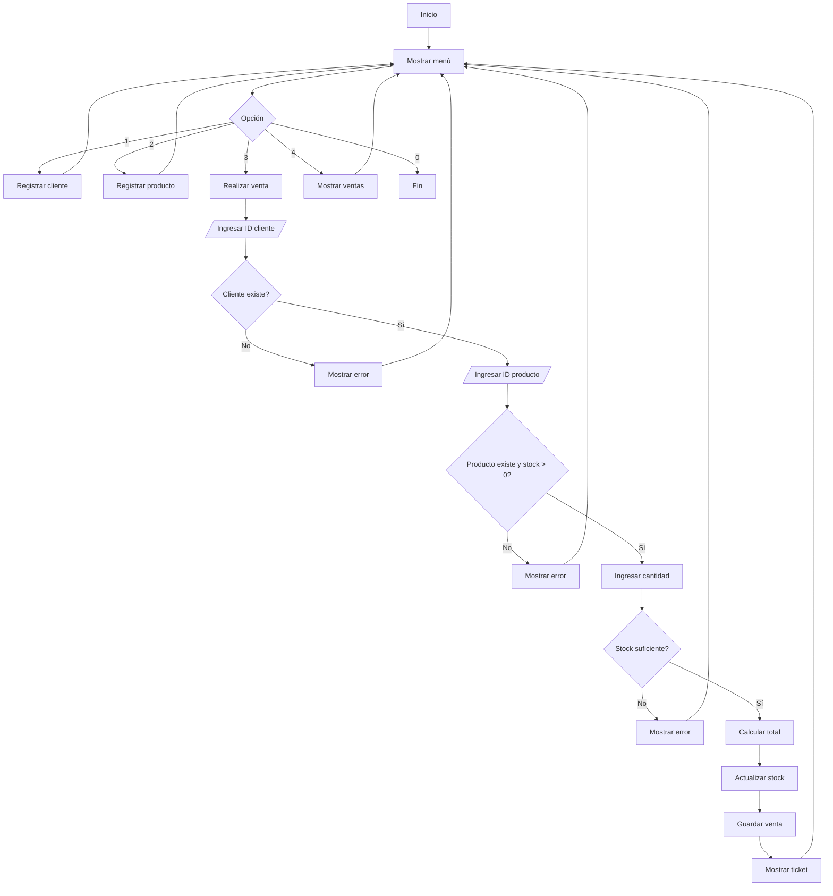

# Introduccion a la Programacion orientada a Objetos

Antes de la **POO** (Programacion orientada a Objetos), programar era como dar una receta de cocina interminable (Programación Estructurada): si querías cambiar un ingrediente al final, a veces tenías que *reescribir toda la receta*.

La Poo nos permitira organiza el codigo en unidades independientes.

Imagina que realizas que se te solicita crear una aplicacion para una farmcia, una que permita administrar a los clientes, productos y realizar ventas. ¿Como te lo imaginarias? con lo visto hasta ahora talves podrias pensar en algo asi como:
