# INTRODUCCION A LA PROGRAMACION ORIENTADA A OBJETOS

Antes de la **POO** (Programacion orientada a Objetos), programar era como dar una receta de cocina interminable (Programación Estructurada): si querías cambiar un ingrediente al final, a veces tenías que *reescribir toda la receta*.

La Poo nos permitira organiza el codigo en unidades independientes.

Imagina que realizas que se te solicita crear una aplicacion para una farmcia, una que permita administrar a los clientes, productos y realizar ventas. ¿Como te lo imaginarias? con lo visto hasta ahora talves podrias pensar en algo asi como:

- Ejemplo programa para farmacia con programacion Modular-Estructurada

Es funcional y permite registrar productos, ventas y clientes, pero que pasa si queremos añadir algo mas como facturacion, dueños , empleados, etc...
Muchas veces tendremos que repetir codigo,(ctrl + c, ctrl +v) y en ese proceso perder el hilo de lo que haciamos.

Para eso nos apoyaremos de la POO, para tener un codigo mas ordenado y estructurado, escalable y reutulizable.
(Ademas de que es el paradigma de programacion actual para el desarrollo de software, despues de la programacion con IA).

---

## Pilares de La POO

Solo recuerdalos, son 4:
### 1. Abstracion.
Podemos sacar todos los detalles (atributos y metodos) de un objeto cualquiera, pero nos quedaremos solo con lo mas importante
### 2. Encapsulamiento
Proteje los datos para que nadie mas pueda tocar los atributos o metodos de una clase sin permiso
### 3. Polimorfismo
Usa un mismo metodo para distintas tareas
### 4. Herecia
Aprovecha el codigo que ya utilizaste o agrega nuevoas clases de manera mas cencillam reutiliza atributos y metodos

## Conceptos importantes:
### Clase
Es un molde que sirve para crear varios objetos, extrae las caracteristicas principales de los objetos y apartir de ello crear nuevos con distintas caracteristicas.

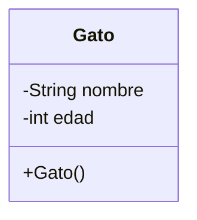

~~~java
public class Gato{
    private String nombre; //atributo
    private int edad; //atributo

    public Gato(string n, int e){ //constructor
        this.nombre = n;
        this.edad = e;
    }
}
~~~

### Objeto 
**Instancia de una clase** se crea apartir de una clase, este toma las caracteristicas y le da valores
~~~java
public class Principal{
    public staatic void main (String args[]){
        Gato g1 = new Gato("firulais", 4); //objeto de la clase gato
        Gato g2 = new Gato("tom", 2); //otro objeto de la clase gato
    }
}
~~~
## Diagramas de clases
Son representaciones graficas de los objetos, se concentra aen mostrac el nombre de la clase, atributos(con encapsulamiento y tipo de dato) y metodos. 

## Abstraccion 
Cada entidad puede ser clasificada, se puede obserbar o imaginar los atributos que tiene, un ejemplo comun es una persona:

De esta podemos sacar varios atriubutos, como el nombre, la edad, altura, peso, raza, genero, carnet, color de ojos, color de pelo, apodo, personalidad, etc....

realizando la abstracion nos quedaria:

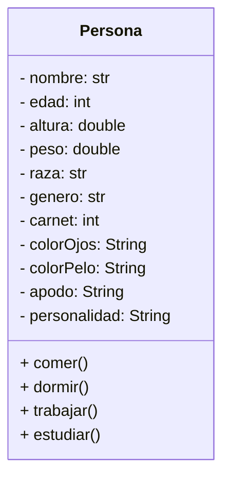
Ademas le agregacom algunas acciones comunes que realiza una persona: comer, dormir, trabajar, estudiar.

Este sera el modelo para automatizar personas, pero realmente todo es necesario?
**Depende del contexto**

No es lo mismo una persona para una banco:

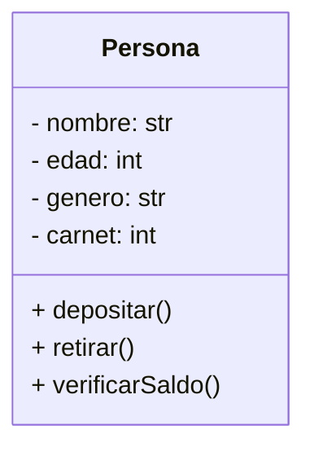

Que para un gimnasio:

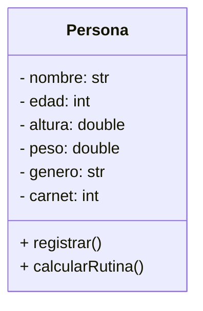
Incluso los metodos cambian

*los metodos representan las acciones que pueden hacer nuestros objetos*

---

## Legunajes de programacion

Luego de poder abstraer una clase, saber que atributos y metodos son necesarios podemos pasar a "Traducir" nuestros diagramas a codigo de programacion. Trabajaremos con dos lenguajes escenciales que soportan manejo de clases y objetos. [Java](https://www.java.com/es/download/) y [Python](https://www.python.org/downloads/windows/).

Trabajemos con la clase Animal:

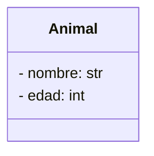

### Java
Empecemos por el nombre de la clase, usando netbeans:
En file elegimos New Proyect...

Luego seleccionamos java with Ant
Java ASplication
y damos siguiente

En proyect name le damos un nombre al proyecto y luego finish

Eso nos creara la clase principal

la clase principal es cualqueira que contenga:

~~~java
public static void main(String[] args) {
        // TODO code application logic here
    }
~~~

todo lo que este dentro de las llaves sera lo primero que buscara el programa para compilar.
Podemos crear una nueva clase haciendo clich cerecho en la carpeta, nuevo y java class...

Aqui ya le daremos el nombre a la clase que queremos crear, en ste caso Animal(*el nombre de la clase siempre empieza por mayuscula*):

Debemos de tener cuidado de donde creamos las clases, ya que si estamos en un paquete incorrecto no se reconocera.

### Python
Para python no necesitamos mas que una archivo, podemos crearlo desde el idle

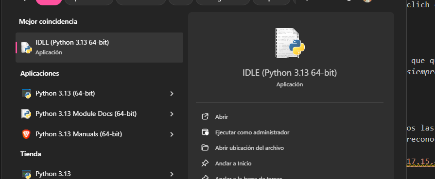

Ahora en File, New File

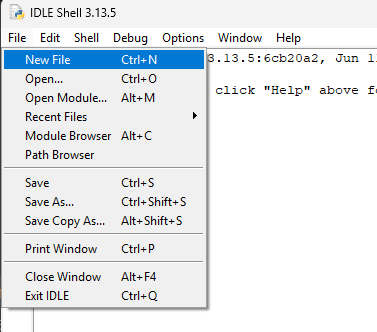
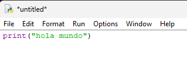

aqui ya podemos crear codigo, y podemos guardar el archivo donde queramos, mejor si nos ordenamos por carpetas
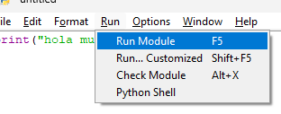
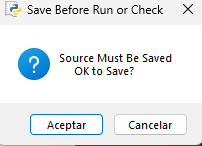

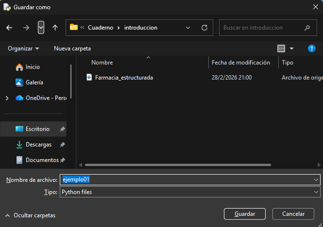

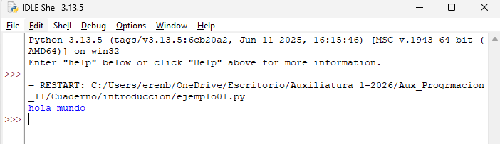

Si queremos podriamos usar el visual estudio code, para abrir mas rapido un proyecto o repositorio solo escribimos cmd en la barra de direecion

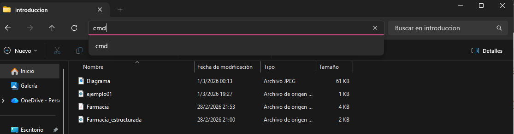

Esto abrira el cmd en esa ubicacion

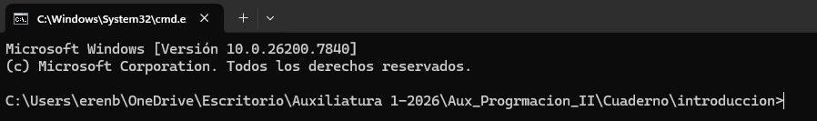

Ahora solo escribimos, con espacio
~~~ 
code .
~~~

Eso abrira el visual studio en esa direccion

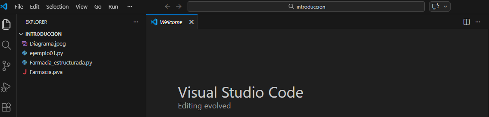

---
##### Ahora si volvamos con la clase

~~~java
public class Animal {
    
    private String Nombre;
    private int edad;
    
}
~~~

Respetamos que el signo menos nos dice que es private, y que nombre es una cadena (String) y edad un entero(int).
Ademas agregaremos un constructor con argumentos.

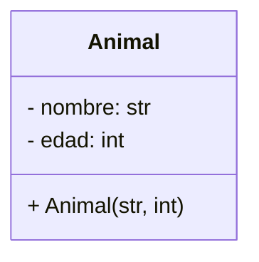

~~~java
public class Animal {
    
    private String Nombre; //atributos
    private int edad;
    
    public Animal(String nom, int ed){ //constructor que recibe una cadena y un entero
        this.nombre = nom; //llamada al atributo
        this.edad = ed;
    }
}
~~~

**Para python** la declaracion de los atributos se hara directamente en el __init__ que es la forma de crear el constructor

~~~python
class Animal():
    def __init__(self, nom, ed):
        self.__nombre = nom
        self.__edad = ed
~~~

~~~
self. #llamada de un atributo dentro de su misma clase(python)
this. //llamada de un atributo dentro de su misma clase(java)
~~~

Ademas identificamos diferenciamos el encapsulamiento con de la siguiente manera:

- self.nombre = nom (atributo publico)
- self.__nombre = nom (atributo privado)

Como definamos nuestro constructor sera la forma en la que crearemos nuestros objetos en la clase principal.

#### Java
~~~java
public class Ejemplo01 {
    public static void main(String[] args) {
        Animal a = new Animal("Firulais", 4);//mandamos un string y un entero
    }
}
~~~

#### Python
~~~python
class Main():
    a = Animal("Firulais", 4)
~~~

