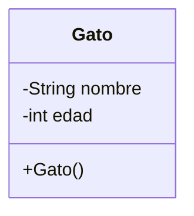
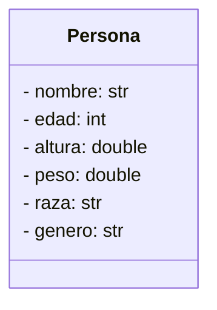

# INTRODUCCION A LA PROGRAMACION ORIENTADA A OBJETOS

Antes de la **POO** (Programacion orientada a Objetos), programar era como dar una receta de cocina interminable (Programación Estructurada): si querías cambiar un ingrediente al final, a veces tenías que *reescribir toda la receta*.

La Poo nos permitira organiza el codigo en unidades independientes.

Imagina que realizas que se te solicita crear una aplicacion para una farmcia, una que permita administrar a los clientes, productos y realizar ventas. ¿Como te lo imaginarias? con lo visto hasta ahora talves podrias pensar en algo asi como:

- Ejemplo programa para farmacia con programacion Modular-Estructurada

Es funcional y permite registrar productos, ventas y clientes, pero que pasa si queremos añadir algo mas como facturacion, dueños , empleados, etc...
Muchas veces tendremos que repetir codigo,(ctrl + c, ctrl +v) y en ese proceso perder el hilo de lo que haciamos.

Para eso nos apoyaremos de la POO, para tener un codigo mas ordenado y estructurado, escalable y reutulizable.
(Ademas de que es el paradigma de programacion actual para el desarrollo de software, despues de la programacion con IA).

---

## Pilares de La POO

Solo recuerdalos, son 4:
### 1. Abstracion.
Podemos sacar todos los detalles (atributos y metodos) de un objeto cualquiera, pero nos quedaremos solo con lo mas importante
### 2. Encapsulamiento
Proteje los datos para que nadie mas pueda tocar los atributos o metodos de una clase sin permiso
### 3. Polimorfismo
Usa un mismo metodo para distintas tareas
### 4. Herecia
Aprovecha el codigo que ya utilizaste o agrega nuevoas clases de manera mas cencillam reutiliza atributos y metodos

## Conceptos importantes:
### Clase
Es un molde que sirve para crear varios objetos, extrae las caracteristicas principales de los objetos y apartir de ello crear nuevos con distintas caracteristicas.

~~~java
public class Gato{
    private String nombre; //atributo
    private int edad; //atributo

    public Gato(string n, int e){ //constructor
        this.nombre = n;
        this.edad = e;
    }
}
~~~

### Objeto 
**Instancia de una clase** se crea apartir de una clase, este toma las caracteristicas y le da valores
~~~java
public class Principal{
    public staatic void main (String args[]){
        Gato g1 = new Gato("firulais", 4); //objeto de la clase gato
        Gato g2 = new Gato("tom", 2); //otro objeto de la clase gato
    }
}
~~~
## Diagramas de clases
Son representaciones graficas de los objetos, se concentra aen mostrac el nombre de la clase, atributos(con encapsulamiento y tipo de dato) y metodos. 

Cuaderno\introduccion\Diagrama.jpeg

## Abstraccion 
Cada entidad puede ser clasificada, se puede obserbar o imaginar los atributos que tiene, un ejemplo comun es una persona:

De esta podemos sacar varios atriubutos, como el nombre, la edad, altura, peso, raza, genero, carnet, color de ojos, color de pelo, apodo, personalidad, etc....

realizando la abstracion nos quedaria:

