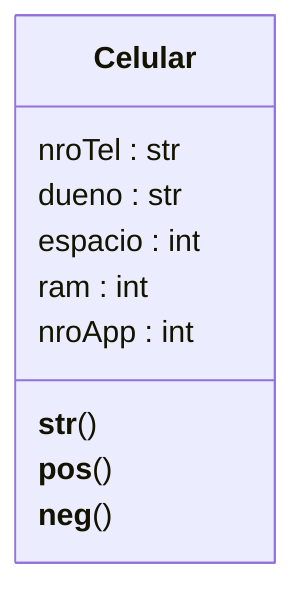

# Polimorfismo

Cuando nos referimos al polimorfismo, hablamos de las formas en las que 

## Diagrama de clases

```mermaid
classDiagram
class Celular{
    nroTel : str
    dueno : str
    espacio : int
    ram : int
    nroApp : int

    __str__()
    __pos__()
    __neg__()
}
```